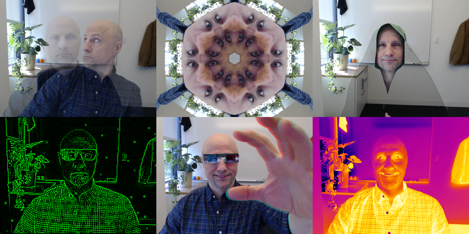

# Pixels to Pictures Supplemental Material &nbsp; &nbsp; 

"[Pixels to Pictures](https://www.mathworks.com/matlabcentral/fileexchange/179159-pixels-to-pictures)" is free courseware authored by MathWorks® to help teach students "the basics of programming while they edit images, build GIFs, and create color filters and face masks that are applied in popular apps."  

*Recommended Ages: 10+*

This repository provides additional MATLAB® live scripts, functions, and apps to supplement the Pixels to Pictures courseware.  The [Courseware Overview](https://www.mathworks.com/content/dam/mathworks/mathworks-dot-com/academia/highschool/courseware/pixels-to-pictures/Syllabus.pdf) is broken down into 5 days.  I teach this material through CoderDojo over the course of 10 lessons (roughly half a "day" per lesson).  As such, the supplemental scripts refer to these lesson numbers instead of the Course Overview day numbers.

Short walkthrough videos for the first five lessons can be found on my [CoderDojo MATLAB YouTube playlist](https://www.youtube.com/playlist?list=PLoRboOyME_RU3JDIk-qSmKbOcy-YXWiCp). (Note, as described below, some of the setup steps have changed.)

## Supplemental Lessons

The supplemental lessons can be used in one of two ways:
1) Open the supplemental project by double-clicking on the `P2P-Supplement.prj` project file from the MATLAB [File Panel](https://www.mathworks.com/help/matlab/ref/filespanel.html). This sets everything up for you, and needs to be done each time you open MATLAB and want to use this material.

2) *Or*, if you already have the base [Pixels to Pictures](https://github.com/mathworks/PixelsToPictures) content installed with the corresponding `PixelstoPictures.prj` project open, you can run these supplemental lessons by navigating to the supplemental "lessons" folder in MATLAB. (This approach provides direct access the [Image Library](https://github.com/mathworks/PixelsToPictures/tree/main/Image%20Library) that comes with Pixels to Pictures.)

### Lesson Summary

* [Lesson 2: Combining Images and Matrices (Pixel Art)](lessons/html/FlagConcatenate.html)
* [Lesson 5: Applying Color Filters to Create 2-Tone Images](lessons/html/Create2ToneImage.html)
* [Lesson 5: Applying Color Filters to Filter 2-Tone Images](lessons/html/Filter2ToneImage.html)
* [Lesson 5: Applying Color Filters to Create 3-D Images](lessons/html/Create3DImage.html)
* [Lesson 7: Creating Complex Color Filters](lessons/html/FlagFilters.html)
* [Lesson 8: Applying Masks using Face Detection](lessons/html/ApplyFaceMask.html)
* [Lesson 9: Creating Video Montage and Flipbooks](lessons/html/AnimateSheet.html)

## Webcam Pixelater App &nbsp; 

Click the Pixelater (color camera) icon above to launch the app in MATLAB Online. This also installs the supplemental lessons and supporting functions, and automatically opens the supplemental project.

*Otherwise* (and in general), to use the app you must first manually open the supplemental project by double-clicking on the `P2P-Supplement.prj` project file from the MATLAB [File Panel](https://www.mathworks.com/help/matlab/ref/filespanel.html). This sets everything up for you, and needs to be done each time you open MATLAB and want to run the app. The app can then be run using the "SHORTCUTS" on the "PROJECT" tab of toolstrip at the top of MATLAB.

**Requires:** *MATLAB R2024b (or newer)*

### Supplemental Effects

* `chroma` : isolate your favorite color in an otherwise grayscale image 
* `cloak` : don a colored cloak and disappear into the background#
* `comic` : create a cartoon-like, comic book effect
* `ghost` : leave a trail of yourself behind as you move
* `gotham` : mask-up to become the knight of a dark and gritty city (*requires Computer Vision Toolbox*™)
* `hologram` : create a 3D effect as you move (when wearing red-cyan 3D glasses)
* `hyperspace` : traveling through it ain't like dustin' crops... punch it!
* `kaleidoscope` : create symmetrical, mirrored patterns (of the lower right portion of the video frame) 
* `matrix` : enter the digital realm of green code and raining pixels
* `pixelate` : apply a blocky pixelation effect to reduce the image resolution
* `quantize` : apply quantization to reduce the number of distinct colors in the image
* `thermal` : apply a color map to make the image look like an infrared thermogram
* `custom` : create and apply your own filters to the app video feed!

# To set the `cloak` background to be an image from the webcam, select `none` from the drop-down (while the video is running) and then `Pause` the video. This image will then be used for the `cloak` background. Press `Play` to resume.

### Pixelater Examples

##

